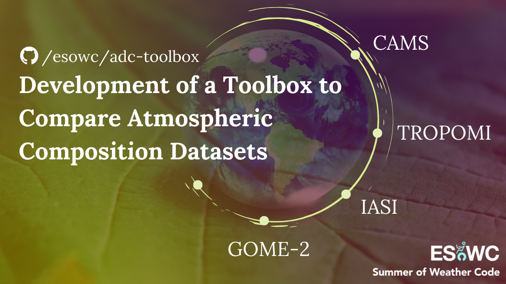

<h1 align="center"><b>ADC Toolbox</b></h1>
<h2 align="center">Comparing Atmospheric Composition Datasets</h2>
</br>

<p align="center"> 
  
</p>


<!-- CONTENTS -->
<h2 id = "contents">Contents</h2>

<details open = "open">
  <summary>Contents</summary>
  <ol>
    <li><a href = "#description">Description</a></li>
    <li><a href = "#datasets">Datasets</a></li>
    <li><a href = "#requirements">Requirements</a></li>
    <li><a href = "#organization">Organization </a></li>
    <li><a href = "#references">References</a></li>
    <li><a href = "#feedback">Feedback</a></li>
    <li><a href = "#author">Author</a></li>
    <li><a href = "#support">Support</a></li>
  </ol>
</details>


<!-- ABOUT THE PROJECT -->
<h2 id = "description">1. Description</h2>

Atmospheric Datasets Comparison (ADC) Toolbox is aimed to have a set of tools that allows users to compare atmospheric composition datasets from different sources. Currently, it is possible to compare:
* Forecast data from CAMS model vs. L2 near real-time and offline data from TROPOMI (NO<sub>2</sub>, O<sub>3</sub>, CO, SO<sub>2</sub>, HCHO), IASI (O<sub>3</sub>, CO, SO<sub>2</sub>) and GOME-2 (NO<sub>2</sub>, O<sub>3</sub>, SO<sub>2</sub>, HCHO) sensors.
* Reanalysis monthly data from CAMS model vs. L3 monthly data from TROPOMI (NO<sub>2</sub>), IASI (O<sub>3</sub>, CO) and GOME-2 (NO<sub>2</sub>) sensors.

A full explanation of the initial version of this software and its theoretical background can be read in <a href = "https://www.researchgate.net/publication/359342884_Development_of_a_Toolbox_to_Compare_Atmospheric_Composition_Datasets_Long-term_trends_in_urban_NO2_concentrations_in_Spain_derived_from_CAMS_reanalysis_and_GOME-2_data" target = "_blank">Research Gate</a>.

Users can install the software in their desktop by following the steps described in <a href = "#requirements">Requirements</a>. A <a href = "https://nbviewer.org/github/esowc/adc-toolbox/blob/main/thesis/case_study.ipynb" target = "_blank">case study</a> was created to show the usability of the toolbox for deriving long-term trends in air pollution. 


<!-- ABOUT THE DATASETS -->
<h2 id = "datasets">2. Datasets</h2>

ADC Toolbox facilitates the retrieval of all the datasets presented in Table 1, since the dates they became available to the public. As an exception, the retrieval of IASI L2 data is currently available only since May 14, 2019.

<p align="center"> Table 1. Temporal availability (start date - end date) by data source.</p>

| Source | Type | Platform | NO<sub>2</sub> | O<sub>3</sub> | CO | SO<sub>2</sub> | HCHO |
| :---: | :---: | :---: | :---: | :---: | :---: | :---: | :---: |
| CAMS  | Forecast | <a href = "https://ads.atmosphere.copernicus.eu/cdsapp#!/dataset/cams-global-atmospheric-composition-forecasts" target = "_blank">ADS</a> | 01.2015 - Present | 01.2015 - Present | 01.2015 - Present | 01.2015 - Present | 01.2015 - Present | 
| CAMS  | Reanalysis | <a href = "https://ads.atmosphere.copernicus.eu/cdsapp#!/dataset/cams-global-ghg-reanalysis-egg4-monthly">ADS</a> | 01.2003 - 06.2021 | 01.2003 - 06.2021 | 01.2003 - 06.2021 | 01.2003 - 06.2021 | 01.2003 - 06.2021 | 
| TROPOMI  | L2 | <a href = "https://s5phub.copernicus.eu/dhus/" target = "_blank">S5-P hub</a> | 07.2018 - Present | 07.2018 - Present | 07.2018 - Present | 10.2018 - Present | 07.2018 - Present | 
| TROPOMI  | L3 | <a href = "https://www.temis.nl/" target = "_blank">TEMIS</a> | 07.2018 - Present | - | - | - | - | 
| IASI  | L2 | <a href = "https://iasi.aeris-data.fr/" target = "_blank">AERIS Portal</a> | - | 01.2008 - Present | 10.2007 - Present | 10.2007 - Present | - |
| IASI  | L3 | <a href = "https://iasi.aeris-data.fr/" target = "_blank">AERIS Portal</a> | - | 01.2008 - Present | 10.2007 - Present | - | - |
| GOME-2  | L2 | <a href = "https://acsaf.org/offline_access.php" target = "_blank">AC SAF</a> | 01.2007 - Present | 01.2007 - Present | - | 01.2007 - Present | 01.2007 - Present | 
| GOME-2  | L3 | <a href = "https://acsaf.org/offline_access.php" target = "_blank">AC SAF</a> | 02.2007 - 11.2017 | - | - | - | - | 
| GOME-2  | L3 | <a href = "https://www.temis.nl/" target = "_blank">TEMIS</a> | 02.2007 - Present | - | - | - | - | 

The temporal availability of each dataset differs from others. CAMS forecasts became available in 2015 and the reanalysis datasets are accessible since 2003. Besides, the satellites that carry the instruments were launched in different years. Sentinel 5-P was launched in 2017, whereas Metop-A, the first European polar-orbiting satellite, was launched in 2006 and de-orbited in 2021. Metop-B and Metop-C have been operational since 2012 and 2018, respectively. 


<!-- REQUIREMENTS -->
<h2 id = "requirements">3. Requirements</h2>
<h3>3.1. General</h3>

The needed packages to run this software can be found in <em>requirements.txt</em>. The virtual environment <em>environment.yml</em> was generated to simplify the installation process, users just need to clone the project, create the environment and activate it with:

```bash
$ conda config --set channel_priority false
$ conda env create -f environment.yml
$ conda activate adc-toolbox
```

If this takes too long, they can manually create it instead <strong>(recommended)</strong>:

```bash
$ conda create --name adc-toolbox
$ conda activate adc-toolbox
$ conda install -c conda-forge/label/cartopy_dev cartopy
$ pip install -r requirements.txt
```

To download data from CAMS, users will need to create an account, <a href = "https://ads.atmosphere.copernicus.eu/api-how-to" target = "_blank">get the ADS API key</a>, create a file with the name <em>keys.txt</em> under the folder <em>data</em>, and write their API key in one line.

It is important to know that this code only runs in Linux operative systems due to the fact that CAMS model data must be downloaded in GRIB format. This can only be done using <em>ecCodes</em>, a package developed by ECMWF that is only available for Linux. In order to install this library, refer to this <a href = "https://gist.github.com/MHBalsmeier/a01ad4e07ecf467c90fad2ac7719844a" target = "_blank">installation guide</a> for clear instructions.

<h3>3.2. Maps visualization</h3>

Lately, there have been problems retrieving the data from NACIS Natural Earth to generate the maps. It has also been found out that there are compatibility issues between the libraries <em>Cartopy</em> and <em>Shapely</em>. It is recommended that <em>Shapely</em> is reinstalled after installing <em>Cartopy</em> and that the maps data are downloaded manually with the following commands:

```bash
!pip install cartopy
!pip uninstall -y shapely
!pip install shapely --no-binary shapely
!wget https://raw.githubusercontent.com/SciTools/cartopy/master/tools/cartopy_feature_download.py
!python cartopy_feature_download.py physical
!python cartopy_feature_download.py cultural
```

<h3>3.3. Scatter plots by country</h3>

In case users want to see the distribution of the components by countries, they will need a Google API Key, Client User ID and Secret. The library Geocoder is used to get the data from Google, but it also allows the users of the ADC-Toolbox to use other APIs to do reverse geocoding (retrieving location information by coordinates). In the function scatter_plot, they will find the following line. You can rewrite as they wish. The list of providers can be found in <a href = "https://github.com/DenisCarriere/geocoder" target = "_blank"> <em>Geocoder</em>'s Github repository</a>.
```python
>>> merge_df['Country'] = merge_df.apply(lambda row: geocoder.google([row['latitude'], row['longitude']], 
                                                     method = 'reverse', key = google_api_key).country_long, 
                                                     axis = 1)
```
If they do not want to edit anything and prefer to run the code using Google API, then they should edit the file <em>keys.txt</em> under the folder <em>data</em>, and write three lines, under their ADS API key. They should contain, in this order, the Google API Key, Client User ID and Secret. They can get their credentials in <a href = "https://console.cloud.google.com/projectselector/google/maps-apis/credentials" target = "_blank">Google Cloud Platform</a>.


<!-- ORGANIZATION -->
<h2 id = "organization">4. Organization</h2>

    ├── README.md                               <- Details about project
    ├── LICENSE                                 <- Details about license
    ├── apt.txt                                 <- Details about requirements (apt-get)
    ├── requirements.txt                        <- Details about requirements (pip)
    ├── environment.yml                         <- Details about virtual environment
    ├── data                                    <- Folder where datasets are stored
    │   │
    │   └── cams                                <- Folder where CAMS datasets are stored
    │       │
    │       ├── 137-levels-definition.csv       <- Details about CAMS L137 levels
    │       └── 60-levels-definition.csv        <- Details about CAMS L60 levels
    │
    ├── functions                               <- Folder that contains all functions
    │   │
    │   ├── functions_general.ipynb             <- Functions that apply to all datasets
    │   ├── functions_cams.ipynb                <- Functions that apply to CAMS datasets
    │   ├── functions_iasi.ipynb                <- Functions that apply to IASI datasets
    │   ├── functions_tropomi.ipynb             <- Functions that apply to TROPOMI datasets
    │   └── functions_gome.ipynb                <- Functions that apply to GOME-2 datasets
    │
    ├── report                                  <- Folder where the images of the README.md are stored
    │
    ├── thesis                                  <- Folder for case study (master's thesis)
    │
    ├── trainings                               <- Folder for trainings material 
    │   │
    │   └── 2021-12-atmospheric-composition     <- 3rd EUMETSAT/ESA/ECMWF Joint Training in AC
    │     │
    │     ├── images                            <- Folder where the images of the training are stored
    │     ├── data-comparison-practical.ipynb   <- Data comparison practical
    │     └── keys-example.txt                  <- File format example of keys.txt (hidden)
    │
    ├── main_cams_gome_L2.ipynb                 <- Comparison between CAMS and GOME-2 L2 datasets
    ├── main_cams_gome_L3.ipynb                 <- Comparison between CAMS and GOME-2 L3 datasets
    ├── main_cams_iasi_L2.ipynb                 <- Comparison between CAMS and IASI L2 datasets
    ├── main_cams_iasi_L3.ipynb                 <- Comparison between CAMS and IASI L3 datasets
    ├── main_cams_tropomi_L2.ipynb              <- Comparison between CAMS and TROPOMI L2 datasets
    └── main_cams_tropomi_L3.ipynb              <- Comparison between CAMS and TROPOMI L3 datasets


<!-- REFERENCES -->
<h2 id = "references">5. References</h2>
<h3>5.1. Data sources</h3>
  <ul>
    <li><a href = "https://ads.atmosphere.copernicus.eu/cdsapp#!/dataset/cams-global-atmospheric-composition-forecasts" target = "_blank">ADS: CAMS global atmospheric composition forecasts</a></li>
    <li><a href = "https://ads.atmosphere.copernicus.eu/cdsapp#!/dataset/cams-global-ghg-reanalysis-egg4-monthly">ADS: CAMS global greenhouse gas reanalysis (EGG4) monthly averaged fields</a></li>
    <li><a href = "https://s5phub.copernicus.eu/dhus" target = "_blank">S5-P hub: TROPOMI datasets (L2)</a></li>
    <li><a href = "https://www.temis.nl/" target = "_blank">TEMIS: TROPOMI and GOME-2 datasets (L3)</a></li>
    <li><a href = "https://iasi.aeris-data.fr/" target = "_blank">AERIS Portal: IASI datasets (L2 and L3)</a></li>
    <li><a href = "https://acsaf.org/offline_access.php" target = "_blank">AC SAF: GOME-2 datasets (L2 and L3)</a></li>
  </ul>

<h3>5.2. Documentation</h3>
  <ul>
    <li><a href = "https://sentinels.copernicus.eu/documents/247904/3119978/Sentinel-5P-Level-2-Input-Output-Data-Definition" target = "_blank"> TROPOMI user manual</a>
    <li><a href = "http://www.tropomi.eu/sites/default/files/files/S5P-KNMI-L2-0021-MA-Product_User_Manual_for_the_Sentinel_5_precursor_Nitrogen_dioxide-0.8.1_20151207_signed.pdf" target = "_blank">TROPOMI NO<sub>2</sub> product manual</a>
    <li><a href = "http://www.tropomi.eu/sites/default/files/files/Sentinel-5P-Level-2-Product-User-Manual-Carbon-Monoxide_v1.00.02_20180613.pdf" target = "_blank">TROPOMI CO product manual</a>
    <li><a href = "https://readthedocs.org/projects/sentinelsat/downloads/pdf/stable/" target = "_blank">SENTINEL API documentation</a>
    <li><a href = "http://xarray.pydata.org/en/stable/api.html" target = "_blank">Xarray API reference</a>
  </ul>
  
<h3>5.3. Other useful references</h3>
  <ul>
    <li><a href = "https://gitlab.eumetsat.int/eumetlab/atmosphere/atmosphere/-/blob/master/functions.ipynb" target = "_blank">Supporting functions from LTPy training course</a></li>
    <li><a href = "https://confluence.ecmwf.int/display/OIFS/4.4+OpenIFS%3A+Vertical+Resolution+and+Configurations">CAMS model vertical resolution and configuration</a></li>
  </ul>


<!-- FEEDBACK -->
<h2 id = "feedback">6. User feeback form</h2>

If you are interested in the ADC toolbox and would like it to have other functionalities or datasets, you can <a href = "https://docs.google.com/forms/d/e/1FAIpQLSd2DYumvDcIGIz1cQrbfezOOEdGBFli5q76uZvmLva6mZ0E7w/viewform?usp=sf_link" target = "_blank">write your feedback in this form</a>. <strong>Thank you very much!</strong>


<!-- AUTHOR -->
<h2 id = "author">7. Author</h2>
<p align = "center"></img><br>
<b>Alba Vilanova Cortezón</b><br>
BEng in Mechanical Engineering at <a href ="https://www.udl.cat/ca/en/" target = "_blank">University of Lleida</a> and <a href ="http://eng.inha.ac.kr/" target = "_blank">Inha University</a><br>
MSc in Geospatial Technologies at <a href ="https://www.novaims.unl.pt/default" target = "_blank">NOVA University of Lisbon</a>, <a href ="https://www.uni-muenster.de/en/" target = "_blank">WWU Münster</a> and <a href ="https://www.uji.es/" target = "_blank">UJI</a><br>
GitHub: <a href="https://github.com/albavilanova" target = "_blank">@albavilanova</a><br>
LinkedIn: <a href="https://www.linkedin.com/in/albavilanova" target = "_blank">@albavilanova</a><br>
Website: <a href = "https://albavilanova.es/" target = "_blank">https://albavilanova.es/</a><br>
</p>


<!-- SUPPORT -->
<h2 id = "support">8. Support</h2>
ADC-Toolbox has been developed under the framework set by <a href ="https://esowc.ecmwf.int/" target = "_blank">ECMWF Summer of Weather Code</a>:<br><br>
<p align = "center"></img></p>
A special <b>thanks to my mentors Federico Fierli, Antje Inness and Miha Razinger</b> for their support and guidance.