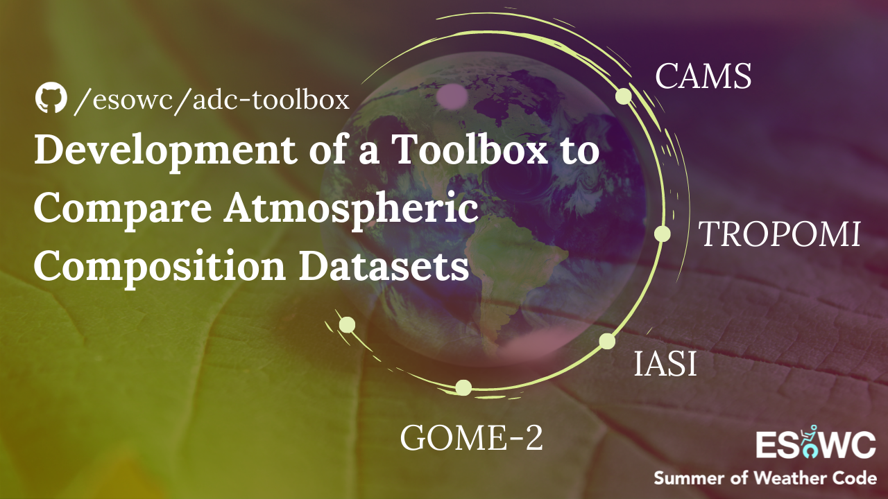

<h1 align = "center"><b>ADC Toolbox</b></h1>
<h3 align = "center"><b>Comparing Atmospheric Composition Datasets</b></h3>

</br>

<p align="center"> 
  
</p>


<!-- CONTENTS -->
<h2 id = "contents">Contents</h2>

<details open = "open">
  <summary>Contents</summary>
  <ol>
    <li><a href = "#description">Description</a></li>
    <li><a href = "#requirements">Requirements</a></li>
    <li><a href = "#organization">Organization </a></li>
    <li><a href = "#references"> References</a></li>
    <li><a href = "#author"> Author</a></li>
  </ol>
</details>


<!-- ABOUT THE PROJECT -->
<h2 id = "description">Description</h2>

Atmospheric Datasets Comparison (ADC) Toolbox is aimed to have a set of tools that allows users to compare atmospheric composition datasets from different sources. Currently, it is possible to compare <a href = "https://ads.atmosphere.copernicus.eu/cdsapp#!/dataset/cams-global-atmospheric-composition-forecasts" target = "_blank">forecast</a> and <a href = "https://ads.atmosphere.copernicus.eu/cdsapp#!/dataset/cams-global-reanalysis-eac4">reanalysis</a> data from CAMS model and <a href = "https://iasi.aeris-data.fr/" target = "_blank">IASI</a> and <a href = "http://www.tropomi.eu/" target = "_blank">TROPOMI</a> sensors.


<!-- REQUIREMENTS -->
<h2 id = "requirements">Requirements</h2>

The main packages that must be downloaded to be able to run this software can be found in the requirements.txt file.

```
pip install -r requirements.txt
```

It is important to know that this code only runs in Linux operative systems due to the fact that CAMS model data must be downloaded as grib files, which can only be done using ecCodes, a package developed by ECMWF that is only available for Linux. In order to install this library, refer to this <a href = "https://gist.github.com/MHBalsmeier/a01ad4e07ecf467c90fad2ac7719844a" target = "_blank">installation guide</a> for clear instructions.

Another important aspect of the installation is that the library cartopy (maps visualization) requires the following modules, that can be installed via the command line with:

`$ sudo apt-get install libproj-dev proj-data proj-bin`

`$ sudo apt-get install libgeos-dev`

`$ sudo pip install cython`


<!-- ORGANIZATION -->
<h2 id = "organization">Organization</h2>

    ├── README.md                    <- Details about the project
    ├── LICENSE                      <- Details about the license
    ├── requirements.txt             <- Details about the requirements
    ├── data                         <- Folder where the datasets are stored
    │   │
    │   └── cams                     <- Folder for CAMS datasets
    │       └── 137-levels.csv       <- Details about CAMS model levels
    │
    ├── functions                    <- Folder that contains functions
    │   │
    │   ├── functions_general.ipynb  <- Functions that apply to all datasets
    │   ├── functions_cams.ipynb     <- Functions that apply to the datasets from CAMS model
    │   ├── functions_iasi.ipynb     <- Functions that apply to the datasets from IASI sensor
    │   └── functions_tropomi.ipynb  <- Functions that apply to the datasets from TROPOMI sensor
    │
    ├── main_cams_iasi.ipynb         <- Example of how to use the functions to compare CAMS and IASI datasets
    └── main_cams_tropomi.ipynb      <- Example of how to use the functions to compare CAMS and TROPOMI datasets


<!-- REFERENCES -->
<h2 id = "references">References</h2>
<h3>Data sources</h3>
  <ul>
    <li><a href = "https://ads.atmosphere.copernicus.eu/cdsapp#!/dataset/cams-global-atmospheric-composition-forecasts?tab=overview" target = "_blank">CAMS global atmospheric composition forecasts</a></li>
    <li><a href = "https://ads.atmosphere.copernicus.eu/cdsapp#!/dataset/cams-global-reanalysis-eac4">CAMS global reanalysis</a>
    <li><a href = "https://iasi.aeris-data.fr/" target = "_blank">IASI observation datasets</a>
    <li><a href = "https://s5phub.copernicus.eu/dhus" target = "_blank">TROPOMI observation datasets</a>
  </ul>

<h3>Important documentation</h3>
  <ul>
    <li><a href = "https://sentinels.copernicus.eu/documents/247904/3119978/Sentinel-5P-Level-2-Input-Output-Data-Definition" target = "_blank"> TROPOMI user manual</a>
    <li><a href = "http://www.tropomi.eu/sites/default/files/files/S5P-KNMI-L2-0021-MA-Product_User_Manual_for_the_Sentinel_5_precursor_Nitrogen_dioxide-0.8.1_20151207_signed.pdf" target = "_blank">TROPOMI NO2 product manual</a>
    <li><a href = "http://www.tropomi.eu/sites/default/files/files/Sentinel-5P-Level-2-Product-User-Manual-Carbon-Monoxide_v1.00.02_20180613.pdf" target = "_blank">TROPOMI CO product manual</a>
    <li><a href = "https://readthedocs.org/projects/sentinelsat/downloads/pdf/stable/" target = "_blank">SENTINEL API documentation</a>
    <li><a href = "http://xarray.pydata.org/en/stable/api.html" target = "_blank">Xarray API reference</a>
  </ul>

<h3>Other useful sources</h3>
  <ul>
    <li><a href = "http://christopherbull.com.au/python/scipy-interpolate-griddata/" target = "_blank">Grid interpolation</a>
    <li><a href = "https://gitlab.eumetsat.int/eumetlab/atmosphere/atmosphere/-/blob/master/functions.ipynb" target = "_blank">Visualization function</a>
    <li><a href = "https://matplotlib.org/2.0.2/examples/pylab_examples/image_masked.html" target = "_blank">Masking NaN values</a>
    <li><a href = "https://confluence.ecmwf.int/pages/viewpage.action?pageId=153391710" target = "_blank">Units conversion</a>
  </ul>


<!-- AUTHOR -->
<h2 id = "author">Author</h2>
<p align = "center"></img></p>
<p align = "center">
<b>Alba Vilanova Cortezón</b><br>
Software developer intern at <a href="https://www.meteomatics.com/en/" target = "_blank">Meteomatics AG</a><br>
BSc in Mechanical Engineering at University of Lleida<br>
MSc in Geospatial Technologies at NOVA University of Lisbon, WWWU Münster and UJI<br>
GitHub: <a href="https://github.com/albavilanova" target = "_blank">@albavilanova</a><br>
LinkedIn: <a href="https://www.linkedin.com/in/albavilanova" target = "_blank">@albavilanova</a><br>
Website: <a href = "https://albavilanova.es/" target = "_blank">https://albavilanova.es/</a><br>
</p>