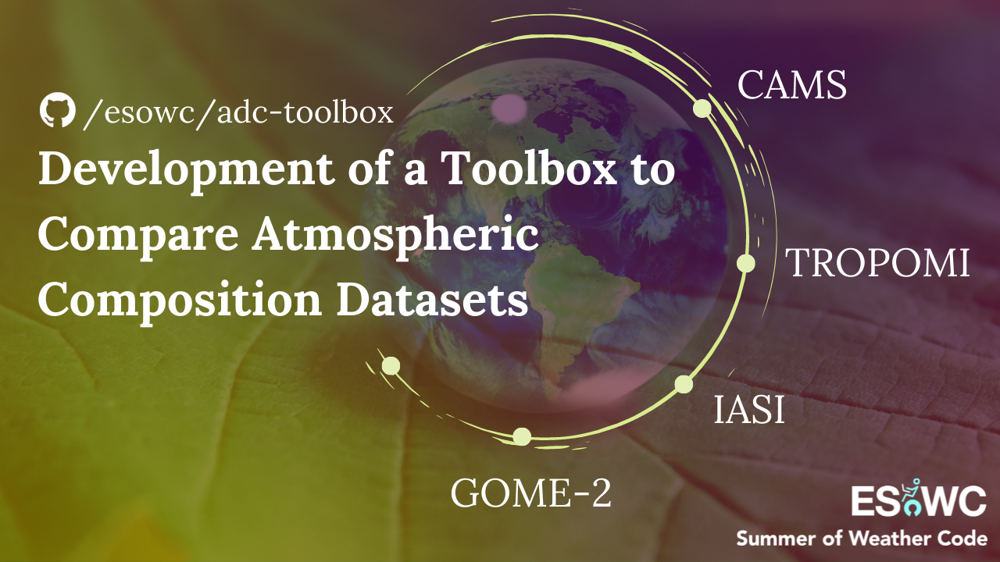

<h1 align="center"><b>ADC Toolbox</b></h1>
<h2 align="center">Comparing Atmospheric Composition Datasets</h2>
</br>

<p align="center"> 
  
</p>


<!-- CONTENTS -->
<h2 id = "contents">Contents</h2>

<details open = "open">
  <summary>Contents</summary>
  <ol>
    <li><a href = "#description">Description</a></li>
    <li><a href = "#datasets">Datasets</a></li>
    <li><a href = "#requirements">Requirements</a></li>
    <li><a href = "#organization">Organization </a></li>
    <li><a href = "#references">References</a></li>
    <li><a href = "#author">Author</a></li>
    <li><a href = "#support">Support</a></li>
  </ol>
</details>


<!-- ABOUT THE PROJECT -->
<h2 id = "description">1. Description</h2>

Atmospheric Datasets Comparison (ADC) Toolbox is aimed to have a set of tools that allows users to compare atmospheric composition datasets from different sources. Currently, it is possible to compare:
* Forecast data from CAMS model vs. L2 near real-time and offline data from TROPOMI (NO<sub>2</sub>, CO, O<sub>3</sub>, SO<sub>2</sub>), IASI (O<sub>3</sub>) and GOME-2 (NO<sub>2</sub>, O<sub>3</sub>, HCHO) sensors.
* Reanalysis monthly data from CAMS model vs. L3 monthly data from IASI (CO, O<sub>3</sub>) and GOME-2 (NO<sub>2</sub>) sensors.


<!-- ABOUT THE DATASETS -->
<h2 id = "datasets">2. Datasets</h2>

ADC-toolbox facilitates the retrieval of all the datasets presented in Table 1, since the dates they became available to the public. As an exception, the retrieval of IASI L2 data is currently available only since May 14, 2019.

<p align="center"> Table 1. Temporal availability (start date - present) by data source.</p>

| Dataset | Type | NO<sub>2</sub> | O<sub>3</sub> | CO | SO<sub>2</sub> | HCHO |
| :---: | :---: | :---: | :---: | :---: | :---: | :---: |
| CAMS  | <a href = "https://ads.atmosphere.copernicus.eu/cdsapp#!/dataset/cams-global-atmospheric-composition-forecasts" target = "_blank">Forecast</a> | 01.2015 | 01.2015 | 01.2015 | 01.2015 | 01.2015 | 
| CAMS  | <a href = "https://ads.atmosphere.copernicus.eu/cdsapp#!/dataset/cams-global-ghg-reanalysis-egg4-monthly">Reanalysis</a> | 01.2003 | 01.2003 | 01.2003 | 01.2003 | 01.2003 | 
| TROPOMI  | <a href = "https://s5phub.copernicus.eu/dhus/" target = "_blank">L2</a> | 07.2018 | 07.2018 | 07.2018 | 10.2018 | - | 
| IASI  | <a href = "https://iasi.aeris-data.fr/" target = "_blank">L2</a> | - | 01.2008 | 10.2007 | 10.2007 | - |
| IASI  | <a href = "https://iasi.aeris-data.fr/" target = "_blank">L3</a> | - | 01.2008 | 10.2007 | 10.2007 | - |
| GOME-2  | <a href = "https://acsaf.org/offline_access.php" target = "_blank">L2</a> | 01.2007 | 01.2007 | - | 01.2007 | 01.2007 | 
| GOME-2  | <a href = "https://acsaf.org/offline_access.php" target = "_blank">L3</a> | 02.2007 | 01.2007 | - | 01.2007 | 01.2007 | 

The temporal availability of each dataset differs from others. CAMS forecasts became available in 2015 and the reanalysis datasets are accessible since 2003. Besides, the satellites that carry the instruments were launched in different years. Sentinel 5-P was launched in 2017, whereas Metop-A, the first European polar-orbiting satellite, was launched in 2006 and will be de-orbited in 2021. Metop-B and Metop-C have been operational since 2012 and 2018, respectively. 


<!-- REQUIREMENTS -->
<h2 id = "requirements">3. Requirements</h2>
<h3>3.1. General</h3>

The main packages that must be downloaded to be able to run this software can be found in <em>requirements.txt</em> and <em>apt.txt</em>. The library cartopy (for the maps visualization) requires the following modules, that can be installed via <em>apt.txt</em>:

```bash
$ sudo apt-get update install
```

Or with:

```bash
$ sudo apt-get install libproj-dev proj-data proj-bin
$ sudo apt-get install libgeos-dev
$ sudo pip install cython
```

Once installed, you can run:

```bash
!pip install -r requirements.txt
```

It is important to know that this code only runs in Linux operative systems due to the fact that CAMS model data must be downloaded in GRIB format. This can only be done using <em>ecCodes</em>, a package developed by ECMWF that is only available for Linux. In order to install this library, refer to this <a href = "https://gist.github.com/MHBalsmeier/a01ad4e07ecf467c90fad2ac7719844a" target = "_blank">installation guide</a> for clear instructions.

To download data from CAMS, you will also need to create an account and <a href = "https://ads.atmosphere.copernicus.eu/api-how-to" target = "_blank">install the ADS API key</a> and create a file with the name <em>keys.txt</em> under the folder <em>data</em>, and write one line with your API key.

<h3>3.2. Maps visualization</h3>

Lately, there have been problems retrieving the data from NACIS Natural Earth to generate the maps. It has also been found out that there are compatibility issues between the libraries <em>Cartopy</em> and <em>Shapely</em>. It is recommended that <em>Shapely</em> is reinstalled after installing <em>Cartopy</em> and that the maps data are downloaded manually with the following commands:

```bash
!pip install cartopy
!pip uninstall -y shapely
!pip install shapely --no-binary shapely
!wget https://raw.githubusercontent.com/SciTools/cartopy/master/tools/cartopy_feature_download.py
!python cartopy_feature_download.py physical
!python cartopy_feature_download.py cultural
```

<h3>3.3. Scatter plots by country</h3>

In case you want to see the distribution of the components by countries, you will need a Google API Key, Client User ID and Secret. The library Geocoder is used to get the data from Google, but it also allows the users of the ADC-Toolbox to use other APIs to do reverse geocoding (retrieving location information by coordinates). In the function scatter_plot, you will find the following line. You can rewrite as you wish. The list of providers can be found in <a href = "https://github.com/DenisCarriere/geocoder" target = "_blank"> <em>Geocoder</em>'s Github repository</a>.
```python
>>> merge['Country'] = merge.apply(lambda row: geocoder.google([row['latitude'], row['longitude']], 
                                   method='reverse', key = google_api_key).country_long, axis = 1)
```
If you do not want to edit anything and prefer to run the code using Google API, then you should edit the file <em>keys.txt</em> under the folder <em>data</em>, and write three lines, under your ADS API key. They should contain, in this order, the Google API Key, Client User ID and Secret.


<!-- ORGANIZATION -->
<h2 id = "organization">4. Organization</h2>

    ├── README.md                   <- Details about the project
    ├── LICENSE                     <- Details about the license
    ├── requirements.txt            <- Details about the requirements
    ├── data                        <- Folder where the datasets are stored
    │   │
    │   └── cams                    <- Folder for CAMS datasets
    │       └── 137-levels.csv      <- Details about CAMS model levels
    │
    ├── functions                   <- Folder that contains functions
    │   │
    │   ├── functions_general.ipynb <- Functions that apply to all datasets
    │   ├── functions_cams.ipynb    <- Functions that apply to the datasets from CAMS model
    │   ├── functions_iasi.ipynb    <- Functions that apply to the datasets from IASI sensor
    │   ├── functions_tropomi.ipynb <- Functions that apply to the datasets from TROPOMI sensor
    │   └── functions_gome.ipynb    <- Functions that apply to the datasets from GOME-2 sensor
    │
    ├── main_cams_gome_L2.ipynb     <- Example of how to use the functions to compare CAMS and GOME-2 L2 datasets
    ├── main_cams_gome_L3.ipynb     <- Example of how to use the functions to compare CAMS and GOME-2 L3 datasets
    ├── main_cams_iasi_L2.ipynb     <- Example of how to use the functions to compare CAMS and IASI L2 datasets
    ├── main_cams_iasi_L3.ipynb     <- Example of how to use the functions to compare CAMS and IASI L3 datasets
    └── main_cams_tropomi_L2.ipynb  <- Example of how to use the functions to compare CAMS and TROPOMI L2 datasets


<!-- REFERENCES -->
<h2 id = "references">5. References</h2>
<h3>5.1. Data sources</h3>
  <ul>
    <li><a href = "https://ads.atmosphere.copernicus.eu/cdsapp#!/dataset/cams-global-atmospheric-composition-forecasts" target = "_blank">CAMS global atmospheric composition forecasts</a></li>
    <li><a href = "https://ads.atmosphere.copernicus.eu/cdsapp#!/dataset/cams-global-ghg-reanalysis-egg4-monthly">CAMS global greenhouse gas reanalysis (EGG4) monthly averaged fields</a>
    <li><a href = "https://iasi.aeris-data.fr/" target = "_blank">IASI observation datasets</a>
    <li><a href = "https://s5phub.copernicus.eu/dhus" target = "_blank">TROPOMI observation datasets</a>
    <li><a href = "https://acsaf.org/offline_access.php" target = "_blank">GOME-2 observation datasets</a>
    <li><a href = "https://developers.google.com/maps/documentation/geocoding/overview" target = "_blank">Google Geocoding API</a></li>
  </ul>

<h3>5.2. Important documentation</h3>
  <ul>
    <li><a href = "https://sentinels.copernicus.eu/documents/247904/3119978/Sentinel-5P-Level-2-Input-Output-Data-Definition" target = "_blank"> TROPOMI user manual</a>
    <li><a href = "http://www.tropomi.eu/sites/default/files/files/S5P-KNMI-L2-0021-MA-Product_User_Manual_for_the_Sentinel_5_precursor_Nitrogen_dioxide-0.8.1_20151207_signed.pdf" target = "_blank">TROPOMI NO2 product manual</a>
    <li><a href = "http://www.tropomi.eu/sites/default/files/files/Sentinel-5P-Level-2-Product-User-Manual-Carbon-Monoxide_v1.00.02_20180613.pdf" target = "_blank">TROPOMI CO product manual</a>
    <li><a href = "https://readthedocs.org/projects/sentinelsat/downloads/pdf/stable/" target = "_blank">SENTINEL API documentation</a>
    <li><a href = "http://xarray.pydata.org/en/stable/api.html" target = "_blank">Xarray API reference</a>
  </ul>

<h3>5.3. Other useful sources</h3>
  <ul>
    <li><a href = "http://christopherbull.com.au/python/scipy-interpolate-griddata/" target = "_blank">Grid interpolation</a>
    <li><a href = "https://gitlab.eumetsat.int/eumetlab/atmosphere/atmosphere/-/blob/master/functions.ipynb" target = "_blank">Visualization function</a>
    <li><a href = "https://matplotlib.org/2.0.2/examples/pylab_examples/image_masked.html" target = "_blank">Masking NaN values</a>
    <li><a href = "https://confluence.ecmwf.int/pages/viewpage.action?pageId=153391710" target = "_blank">Units conversion</a>
    <li><a href = "https://github.com/DenisCarriere/geocoder" target = "_blank">Reverse geocoding</a></li>
  </ul>


<!-- AUTHOR -->
<h2 id = "author">6. Author</h2>
<p align = "center"></img><br>
<b>Alba Vilanova Cortezón</b><br>
BEng in Mechanical Engineering at <a href ="https://www.udl.cat/ca/en/" target = "_blank">University of Lleida</a> and <a href ="http://eng.inha.ac.kr/" target = "_blank">Inha University</a><br>
MSc in Geospatial Technologies at <a href ="https://www.novaims.unl.pt/default" target = "_blank">NOVA University of Lisbon</a>, <a href ="https://www.uni-muenster.de/en/" target = "_blank">WWU Münster</a> and <a href ="https://www.uji.es/" target = "_blank">UJI</a><br>
GitHub: <a href="https://github.com/albavilanova" target = "_blank">@albavilanova</a><br>
LinkedIn: <a href="https://www.linkedin.com/in/albavilanova" target = "_blank">@albavilanova</a><br>
Website: <a href = "https://albavilanova.es/" target = "_blank">https://albavilanova.es/</a><br>
</p>


<!-- SUPPORT -->
<h2 id = "support">7. Support</h2>
ADC-Toolbox has been developed under the framework set by <a href ="https://esowc.ecmwf.int/" target = "_blank">ECMWF Summer of Weather Code</a>:<br><br>
<p align = "center"></img></p>
A special <b>thanks to my mentors Federico Fierli, Antje Inness and Miha Razinger</b> for their support and guidance.
